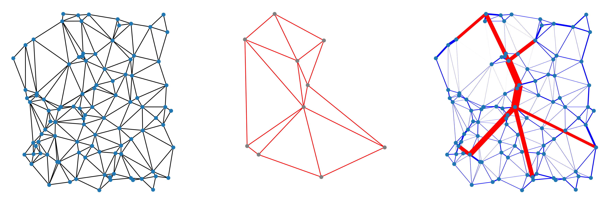

# MultiOT
Optimal transport on Multilayer networks

Python implementation of the MultiOT algorithm described in:

- [1] Ibrahim, A.A.; Lonardi, A.; De Bacco, C. (2021). *Optimal transport in multilayer networks*.  

This is a an algorithm that uses optimal transport theory to find optimal path trajectories in multilayer networks. 

If you use this code please cite [1].   

The paper can be found [here](https://arxiv.org/abs/2106.07202) (_preprint_) and published document [here](https://www.mdpi.com/1999-4893/14/7/189).  

Copyright (c) 2021 [Abdullahi Adinoyi Ibrahim](https://github.com/aadinoyiibrahim), [Alessandro Lonardi](https://github.com/aleable) and [Caterina De Bacco](http://cdebacco.com).

<p align="center">
<br>
</p>

## How to use this code

### Requirements

All the dependencies needed to run the algorithms can be installed using ```setup.py```, in a pre-built ```conda``` environment. <br/>
In particular, this script needs to be executed as:

```bash
python setup.py
```

You are ready to use our code!

### Usage example

Example usage is inside the notebook `./src/usage_example_synthetic_network.ipynb `.  

The main code implementing the dynamics is `./src/dynamics.py`.

## License

Permission is hereby granted, free of charge, to any person obtaining a copy of this software and associated documentation files (the "Software"), to deal in the Software without restriction, including without limitation the rights to use, copy, modify, merge, publish, distribute, sublicense, and/or sell copies of the Software, and to permit persons to whom the Software is furnished to do so, subject to the following conditions:

The above copyright notice and this permission notice shall be included in all copies or substantial portions of the Software.

THE SOFTWARE IS PROVIDED "AS IS", WITHOUT WARRANTY OF ANY KIND, EXPRESS OR IMPLIED, INCLUDING BUT NOT LIMITED TO THE WARRANTIES OF MERCHANTABILITY, FITNESS FOR A PARTICULAR PURPOSE AND NON INFRINGEMENT. IN NO EVENT SHALL THE AUTHORS OR COPYRIGHT HOLDERS BE LIABLE FOR ANY CLAIM, DAMAGES OR OTHER LIABILITY, WHETHER IN AN ACTION OF CONTRACT, TORT OR OTHERWISE, ARISING FROM, OUT OF OR IN CONNECTION WITH THE SOFTWARE OR THE USE OR OTHER DEALINGS IN THE SOFTWARE.

