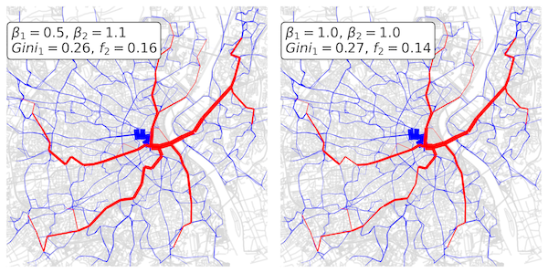
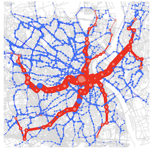
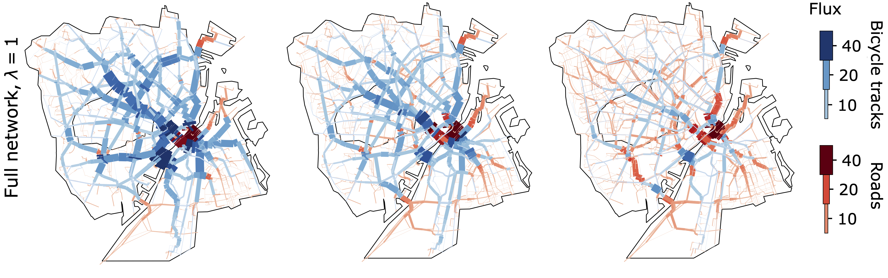

# MultiOT (Optimal Transport Dynamics on Multilayer Networks)

[](https://github.com/psf/black)

---

Python implementation of the MultiOT algorithm employed and developed in:

- [1] Ibrahim, A.A., Lonardi, A., De Bacco, C. *[Optimal transport in multilayer networks](https://www.mdpi.com/1999-4893/14/7/189)*. Algorithms 2021, 14(7), 189 (2021).
- [2] Ibrahim, A.A., Leite, D., De Bacco, C. *[Sustainable optimal transport in multilayer networks](https://doi.org/10.1103/PhysRevE.105.064302)*. Phys. Rev. E 105, 064302 (2022).
- [3] Lonardi, A., Szell, M., De Bacco, C. *[Cohesive urban bicycle infrastructure design through optimal transport routing in multilayer networks](https://royalsocietypublishing.org/doi/10.1098/rsif.2024.0532)*. J. R. Soc. Interface.2220240532 (2025).

This is an algorithm that uses Optimal Transport theory to extract optimal paths in multilayer networks. Such a task is carried out according to the mathematical frameworks formulated in the works above.

**If you use this code please adequately cite the references provided.**

## Table of Contents  
- [MultiOT (Optimal Transport Dynamics on Multilayer Networks)](#multiot-optimal-transport-dynamics-on-multilayer-networks)
  - [Table of Contents](#table-of-contents)
  - [What's included](#whats-included)
  - [How to use](#how-to-use)
    - [Requirements](#requirements)
    - [Code usage](#code-usage)
  - [Code details](#code-details)
    - [Input \& Output](#input--output)
    - [Methods](#methods)
      - [Parameters](#parameters)
    - [Additional files](#additional-files)
  - [Visualizations](#visualizations)
    - [Bordeaux](#bordeaux)
    - [Copenhagen](#copenhagen)
  - [Contacts](#contacts)

## What's included

- ```main.py```: main function of MultiOT that controls all methods contained in ```src/```.
- ```src/```: source folder containing all core methods.
- ```dashboard.ipynb```: tutorial notebook with basic usage of the code.
- ```data/input/real_data```: contains all data needed to perform simulations on Copenhagen's transportation network [4].
- ```data/output/synthetic/```: default output directory to serialize results of the algorithm.
- ```setup.py```: setup file to build the Python environment.
- ```utils.ipynb```: functions used by ```dashboard.ipynb```.
- ```misc/```: files used for the README.md.

[4] Michael Szell, *<a href="https://doi.org/10.5281/zenodo.5083049"> Urban bicycle networks, existing and synthetically grown (1.0.0)</a>*. Zenodo (2021).<br/>

## How to use

### Requirements

All the dependencies needed to run the algorithms can be installed using ```setup.py```, in a pre-built ```conda``` environment. In particular, this script needs to be executed as:

```bash
python setup.py
```

### Code usage
To download this repository, copy and paste the following line into your terminal:

```bash
git clone https://github.com/cdebacco/MultiOT
```

**You are ready to test the code! If you want to know how click [HERE](https://github.com/cdebacco/MultiOT/tree/main/dashboard.ipynb) to test it on a notebook.**

## Code details

### Input & Output

The algorithm's main inputs are:
- ```G```: the multilayer network.
- ```S```: the mass matrix containing the mass entry and exit distributions.
- ```w```: the edges weights (Euclidean lengths that are weighted by the code [1-3]).

For Copenhagen's transportation network, these inputs are serialized in ```data/input/real_data/copenhagen_{network,S,w}.pkl```. For synthetic graphs, they are automatically generated by the code.

### Methods

- **```src/dynamics.py```: Multicommodity dynamics on multilayer networks [1,2]**<br/>
    This is a scheme capable of finding optimal multicommodity fluxes on multilayer network networks by solving a dynamical system of equations where different commodities interact and share a unique infrastructure. Traffic congestion can be tuned by means of a critical exponent (```beta```) which can set to be different at every layer.

- **```src/dynamics_sp.py```: Shortest path dynamics on multilayer networks [3]**<br/>
    This method can be employed to find shortest path fluxes on multilayer network networks by solving a dynamical system of equations.

- **```src/dijkstra.py```: Multi-source multi-sink Dijkstra's algorithm on multilayer networks [3]**<br/>
    This script contains a multi-source multi-sink implementation of Dijkstra's algorithm where all Origin-Destination paths are found iteratively using a single-source single-sink Dijkstra.

- **```src/filtering.py```: Shortest path filtering on multilayer networks**<br/>
    This scheme allows the refinement of results extracted by ```src/dynamics_sp.py```. Particularly, network paths containing loops (possibly arising when the convergence thresholds are not properly tuned) can be eliminated by re-running ```src/dynamics_sp.py``` or ```src/dijkstra.py``` on the subgraphs supporting each commodity's fluxes.
#### Parameters
The main parameters used by ```main.py``` to run the code are (together with their data types as requested per input by the algorithm):
- ```topol``` (str): Type of network topology, can be 'synthetic' or 'real'.
- ```Ns``` (str): Number of nodes in each layer.
- ```betas``` (str): Critical exponents in each layer.
- ```ws``` (str): Inverse velocity for all layers (also referred to as alpha for effective lengths).
- ```p```  (float): Monocentric/random inflows of mass for synthetic networks.
- ```V``` (bool): Verbose flag for additional output.
- ```Vtimestep``` (int): Frequency when to print algorithm metadata.
- ```relax``` (float): Relaxation of Laplacian pseudoinverse.
- ```delta``` (float): Discrete-time step.
- ```delta_filtering``` (float): Discrete-time step for filtering.
- ```tot_iterations``` (int): Maximum iteration limit for the algorithm.
- ```epsilonmu``` (float): Convergence threshold for conductivities/capacities.
- ```epsilonJ``` (float): Convergence threshold for OT cost.
- ```epsilonmu_filtering``` (float): Convergence threshold for conductivities/capacities in filtering.
- ```epsilonJ_filtering``` (float): Convergence threshold for OT cost in filtering.
- ```tau_filtering``` (float): Threshold to trim fluxes in dynamics filtering.
- ```seedG``` (int): Seed for random graph generation.
- ```seedmu``` (int): Seed for random noise initialization of conductivities.
- ```seedS``` (int): Seed for random choice of sources/sinks.
- ```dynamics_flag``` (bool): Flag to run multi-commodity dynamics.
- ```dynamics_sp_flag``` (bool): Flag to run shortest path dynamics.
- ```dijkstra_flag``` (bool): Flag to run multi-source multi-sinks Dijkstra's algorithm.
- ```filtering_flag``` (bool): Flag to run filtering.
- ```ifolder``` (str): Input folder containing data.
- ```ofolder``` (str): Output folder for storing results.

### Additional files
- ```src/initialization.py```: Initialize all variables needed for the core methods.
- ```src/generate_planar.py```: Generates a multilayer networks by connecting multiple planar networks, one per layer.
- ```src/tools.py```: Miscellaneous functions used by the core scripts.

## Visualizations

### Bordeaux

<p align="center" width=10%>
<br>
</p>
<p align="center">
<br>
</p>

### Copenhagen

<p align="center" width=100pt>
<br>
</p>


## Contacts

For any issues or questions, feel free to contact us:

- [Caterina De Bacco](http://github.com/cdebacco)
- [Abdullahi Adinoyi Ibrahim](https://github.com/aadinoyiibrahim)
- [Daniela Leite](https://github.com/Danielaleite)
- [Alessandro Lonardi](https://github.com/aleable)
